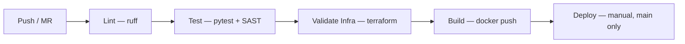

# Audit-Driven Learning Journey — Trainee Cloud & IA: API Flask de health check com pipeline CI/CD completo, containerização Docker e infraestrutura como código para deploy no AWS ECS.

[](https://gitlab.com/badger/quokka/-/pipelines)
[]()
[]()
[]()
[](#rate-limiting-limitations)

---

## Como Rodar a Aplicação Localmente

### Opção 1: Docker Compose (recomendado)

```bash
docker compose up --build
```

A aplicação estará disponível em `http://localhost:5000`.

### Opção 2: Docker Manual

> **Nota:** O Dockerfile usa BuildKit cache mounts (`--mount=type=cache`). Requer Docker com BuildKit habilitado. Se o build falhar com "the --mount option requires BuildKit", instale o `docker-buildx` plugin ou use `DOCKER_BUILDKIT=1 docker build ...`.

```bash
docker build -t trainee-devops-api .
docker run -d -p 5000:5000 --name trainee-api trainee-devops-api
```

### Opção 3: Python Direto

> **Requer Python >= 3.11** — o código usa `datetime.UTC`, introduzido no Python 3.11.

```bash
python3 -m venv venv
source venv/bin/activate
pip install -r requirements.txt
python app.py
```

### Verificando a Aplicação

```bash
curl http://localhost:5000/health
curl http://localhost:5000/
```

## API Examples

### Health Check Endpoint

```bash
# Basic health check
curl -X GET http://localhost:5000/health

# With verbose output
curl -v http://localhost:5000/health

# With timing information
curl -w "\nTime: %{time_total}s\n" http://localhost:5000/health
```

Expected response:
```json
{
  "status": "healthy",
  "timestamp": "2024-01-01T00:00:00.000000+00:00",
  "version": "1.0.0"
}
```

### Root Endpoint

```bash
# Basic root endpoint
curl -X GET http://localhost:5000/

# With headers
curl -H "Accept: application/json" http://localhost:5000/
```

Expected response:
```json
{
  "message": "Trainee DevOps API"
}
```

### Error Handling Examples

```bash
# Test 404 - Not Found
curl -X GET http://localhost:5000/nonexistent

# Test rate limiting (send 11+ requests in quick succession)
for i in {1..15}; do curl -s -o /dev/null -w "%{http_code}\n" http://localhost:5000/health; done
```

### Rate Limiting Test

```bash
# Default limit: 100 requests per hour, 10 per minute per endpoint
# Test rate limit on /health endpoint (limit: 10 per minute)
for i in {1..12}; do 
  echo -n "Request $i: "
  curl -s -o /dev/null -w "%{http_code}\n" http://localhost:5000/health
done
```

Expected: First 10 requests return 200, subsequent requests return 429 (Too Many Requests)

Ou use o script de healthcheck (sem dependência de Python, funciona com wget apenas):

```bash
chmod +x healthcheck.sh
./healthcheck.sh
./healthcheck.sh localhost 5000
```

### Rodar os testes localmente

```bash
pip install -r requirements.txt -r requirements-dev.txt
pytest test_app.py -v
```

---

## Como o Pipeline Funciona

### Fluxo Visual



O pipeline `.gitlab-ci.yml` possui 5 stages sequenciais (lint → test → validate-infra → build → deploy) + 1 job bonus de segurança (SAST no stage test):

### Stage 1: Lint

- **Ferramenta:** `ruff` — linter Python moderno, 10-100x mais rápido que flake8
- **O que faz:** Analisa `app.py` e `test_app.py` buscando erros de estilo, imports não utilizados e más práticas
- **Critério de falha:** Job falha se o ruff encontrar qualquer violação
- **Quando roda:** Em MRs e na branch main (controlado por `workflow.rules` para evitar pipelines duplicados)

### Stage 2: Test (pytest + bandit)

- **Ferramenta:** `pytest`
- **O que faz:** Executa os testes unitários em `test_app.py` validando os endpoints `/health` e `/`
- **Critério de falha:** Job falha se qualquer teste não passar
- **Quando roda:** Em MRs e na branch main

### Stage 2 (bonus): SAST — Security Scan

- **Ferramenta:** `bandit`
- **O que faz:** Análise estática de segurança no código Python, identificando vulnerabilidades comuns
- **Critério de falha:** `allow_failure: true` por design — SAST surface findings sem bloquear deploys. Para projetos novos, bloquear por SAST arrisca falsos positivos travando o pipeline. Em produção, considerar gating em severidade HIGH após afinar exclusões.
- **Quando roda:** Na branch main, em MRs e em tags
- **Artefato:** Gera `bandit-report.json` para análise posterior

### Stage 3: Validate Infrastructure (Terraform)

- **Ferramenta:** Terraform (hashicorp/terraform:1.8)
- **O que faz:** Roda `terraform fmt -check`, `terraform validate` e `terraform plan` para validar a infraestrutura antes do deploy.
- **Critério de falha:** Job falha se formatação ou validação falharem.
- **Quando roda:** Main e MRs.

### Stage 4: Build

- **Ferramenta:** Docker (Docker-in-Docker) com BuildKit habilitado
- **O que faz:** Constrói a imagem Docker usando multi-stage build e faz push para o GitLab Container Registry com tags: SHA do commit e `latest` (apenas na main). Tags git (ex: v1.0.0) geram imagem com nome da tag.
- **Critério de falha:** Job falha se build ou push falhar
- **Quando roda:** Main e tags (automático); MRs (manual)
- **Variáveis:** `$CI_REGISTRY`, `$CI_REGISTRY_USER`, `$CI_REGISTRY_PASSWORD`

### Stage 5: Deploy

- **O que faz:** Simula o deploy no AWS ECS imprimindo os comandos que seriam executados
- **Quando roda:** Apenas na branch `main`, com aprovação manual (`when: manual`)
- **Dependência:** Aguarda o stage de build completar (`needs: [build]`)

### Cache do Pipeline

Cache compartilhado entre jobs, key baseada no hash dos dois requirements files (`requirements.txt` + `requirements-dev.txt`) + prefixo por job name. Isso garante que:
- Cache é invalidado automaticamente quando as dependências mudam
- Cada job tem seu próprio namespace de cache (ruff e pytest não se contaminam)
- O cache de ruff não é invalidado por mudanças no pytest, e vice-versa

### Prevenção de Pipelines Duplicados

O bloco `workflow.rules` garante que pipelines só rodam em:
1. Merge request events
2. Pushes na branch main
3. Tags

Isso evita o problema comum de pipelines duplicados (um do MR event, outro do branch push) que desperdiça runner minutes.

---

## Estrutura do Repositório

```
.
├── app.py              # Aplicação Flask
├── test_app.py         # Testes unitários
├── requirements.txt    # Dependências Python (runtime apenas)
├── requirements-dev.txt # Dependências de desenvolvimento (pytest, ruff, bandit)
├── ruff.toml           # Configuração do linter
├── Dockerfile          # Containerização com multi-stage build
├── docker-compose.yml  # Compose para rodar localmente
├── healthcheck.sh      # Script de verificação de saúde (shell puro, sem python)
├── .gitlab-ci.yml      # Pipeline CI/CD
├── .dockerignore       # Arquivos ignorados no build Docker
├── .gitignore          # Arquivos ignorados pelo Git
└── terraform/
    ├── main.tf         # Provider AWS e backend S3
    ├── variables.tf    # Variáveis do Terraform
    ├── ecs.tf          # Recursos ECS, ALB, IAM, CloudWatch, Security Groups
    └── outputs.tf      # Outputs da infraestrutura
```

---

## Decisões Técnicas

### Dockerfile — Multi-stage Build

Separação entre ambiente de build (com pip, cache de downloads) e runtime (apenas o necessário para rodar). O stage `builder` instala dependências em `/install`, e o runtime copia apenas o resultado. Isso exclui cache do pip e ferramentas de build da imagem final, reduzindo tamanho e superfície de ataque.

### Imagem Base — python:3.12-alpine

Alpine (~50MB base) vs slim (~120MB base). Para uma API Flask simples sem dependências nativas, Alpine é suficiente. Menos pacotes = menor superfície de ataque.

**Nota sobre pinned tags:** O Dockerfile usa `python:3.12.7-alpine3.20` (versão específica) em vez de tag flotante. Para este desafio de trainee, isso é aceitável — você recebe reproducibilidade de build. Em produção, considere usar digests (`@sha256:...`) para controle total de supply-chain.

### BuildKit Cache Mounts

O Dockerfile usa `--mount=type=cache,target=/root/.cache/pip` no `pip install` do builder. Isso permite que o Docker reutilize o cache de downloads do pip entre builds, mesmo que a camada de requirements.txt seja invalidada por outros motivos. Requer `DOCKER_BUILDKIT=1` (habilitado no pipeline CI).

### Usuário Não-root

Container roda como `appuser`. Se um atacante comprometer a aplicação, terá acesso limitado — sem privilícios de root. O ECS task definition também especifica `"user": "appuser"` para garantir que o runtime respeite isso.

### Servidor de Desenvolvimento Flask

**ATUALIZADO:** O Dockerfile agora usa Gunicorn como WSGI server production-grade.

O código original usava `app.run()` (Flask built-in server), que é single-threaded, sem worker management, sem timeout handling, não testado em produção em larga escala. Para produção, o Dockerfile foi atualizado para usar Gunicorn com 2 workers e 4 threads:

```dockerfile
CMD ["gunicorn", "--bind", "0.0.0.0:5000", "--workers", "2", "--threads", "4", "app:app"]
```

### Limitações de Treinamento (Não Producao)

Este projeto é um **desafio de trainee** com limitações intencionais para focar em CI/CD e IaC. Abaixo, o que **NÃO** foi implementado e o porquê:

#### ⚠️ Rate Limiting (Demonstration Only - Not Production-Ready)

> **WARNING:** This rate limiting implementation uses in-memory storage (`memory://`). 
> In production with multiple ECS tasks, each container tracks its own limits independently.
> A client can bypass limits by hitting different containers. 
> **For production:** Use Redis (`storage_uri="redis://..."`) or API Gateway rate limiting.
> This implementation is for **demonstration and learning purposes only**.

**Limitação:** O rate limiter usa `storage_uri="memory://"` que armazena contadores na memória local. Em produção com múltiplas réplicas ECS, isso significa:
- Cada container tem seus próprios contadores de rate limit
- Um cliente pode fazer 100 requests/hour **por container**, não no total
- Para rate limiting global, use Redis: `storage_uri="redis://..."`

**Limitação:** O rate limiter usa `storage_uri="memory://"` que armazena contadores na memória local. Em produção com múltiplas réplicas ECS, isso significa:
- Cada container tem seus próprios contadores de rate limit
- Um cliente pode fazer 100 requests/hour **por container**, não no total
- Para rate limiting global, use Redis: `storage_uri="redis://..."`

**Por que assim:** Redis adiciona custo (~$13/mês ElastiCache) e complexidade. Para este desafio de trainee, a limitação é aceitável e documentada.

#### Requer AWS com Cartão de Crédito (fora do escopo trainee):

1. **VPC Default** — Usa a VPC default da AWS com subnets públicas. Produção exigiria VPC dedicada com subnets privadas + NAT Gateway (~$32/mês + transfer). Esta escolha é documentada como fora do escopo.

2. **HTTP sem TLS** — O ALB usa apenas HTTP (porta 80). Produção exigiria HTTPS com certificado ACM (grátis) mas que requer domínio verificado (custo anual de domínio).

3. **NAT Gateway ausente** — ECS tasks usam `assign_public_ip=true` para evitar custo de NAT Gateway (~$32/mês). Produção usaria subnets privadas com NAT.

4. **Sem WAF** — Application Load Balancer sem AWS WAF (~$5/mês + regras). Produção exigiria WAF para proteção contra OWASP Top 10.

5. **Log retention curto** — CloudWatch Logs com retenção de 7 dias. Produção exigiria 90+ dias (custo de armazenamento).

6. **Sem multi-AZ** — Deploy em única zona de disponibilidade. Produção exigiria multi-AZ para disaster recovery (2x custo).

7. **Sem auto-scaling** — Fixed desired_count=2. Produção configuraria auto-scaling baseado em CPU/memória (custo variável).

#### Não Requer Cartão de Crédito (mas fora do escopo do desafio):

8. **Rate limiting com limitações** — Implementado com `flask-limiter`, mas usa armazenamento em memória (ver seção "Rate Limiting com Armazenamento em Memória").

9. **Sem image scanning** — Sem Trivy/Grype no pipeline. Poderia ser adicionado gratuitamente.

10. **Sem S3 state encryption** — Terraform state backend sem criptografia explícita. Deveria usar KMS/SSE.

11. **Sem CloudWatch Alarms** — Sem alertas para falhas de health check, latência, erros 5xx.

12. **Sem testes de integração** — Apenas testes unitários; sem validação end-to-end do container.

### Healthcheck — Validação de HTTP 200 + corpo

O healthcheck valida explicitamente `assert r.status==200`. Embora `urlopen` lance `HTTPError` em 4xx/5xx por padrão, o `assert` torna a intenção explícita e funciona como defense-in-depth — se um handler customizado suprimir a exceção, o assert ainda garante que apenas 200 é aceito.

### Security Groups — Acesso ao container apenas via ALB

Duas security groups separadas:
- **ALB SG:** Aceita HTTP (porta 80) de `0.0.0.0/0` — ponto de entrada público
- **ECS SG:** Aceita tráfego apenas do ALB SG na porta 5000 — containers não são acessíveis diretamente da internet

Isso impede bypass do ALB. Em ECS com `awsvpc` network mode, tasks recebem seus próprios ENIs com IPs — sem essa restrição, qualquer um poderia atingir o container diretamente.

### Linter — ruff em vez de flake8

Ruff é 10-100x mais rápido que flake8, tem regras compatíveis e é o padrão moderno da comunidade Python. Em um pipeline CI/CD, velocidade importa. O arquivo `ruff.toml` configura as regras explicitamente: `E/W` (pycodestyle), `F` (pyflakes), `I` (isort), `UP` (pyupgrade para 3.12+), `B` (bugbear), `SIM` (simplify), `C4` (comprehensions) e `S` (bandit security). Rodar ruff sem config é aceitar defaults cegos — o `ruff.toml` documenta o que consideramos erro e por quê.

### Dependências — Runtime vs Desenvolvimento

`requirements.txt` contém apenas dependências de runtime (flask). `requirements-dev.txt` adiciona pytest, ruff e bandit. O Dockerfile instala apenas `requirements.txt`, excluindo ferramentas de teste da imagem de produção. Isso reduz a superfície de ataque — pytest, ruff e bandit não deveriam existir em um container que serve tráfego.

### SAST — Não-bloqueante por design

O job de SAST usa `allow_failure: true` intencionalmente. Para projetos novos, bloquear o pipeline por findings de SAST arrisca falsos positivos travando deploys. O scan reporta findings de severidade HIGH no log e gera artefato JSON para revisão manual. Em produção, após afinar exclusões, considerar gating em HIGH severity.

### readonlyRootFilesystem — Container imutável

O task definition do ECS define `readonlyRootFilesystem = true`. Se um atacante conseguir RCE, não pode escrever binários, scripts ou configs no filesystem do container. Flask não precisa de writes para esta aplicação — Python ignora `__pycache__` graciosamente quando o diretório é read-only. Em apps que precisam de `/tmp`, um tmpfs mount resolveria; aqui não é necessário.

### Deploy — Manual com `when: manual`

Em produção, deploy deve ser intencional. Mesmo na branch main, o deploy exige aprovação humana. Previne deploys acidentais e permite verificação do build antes de promover.

### Terraform — Simplificado mas Funcional

A configuração cria infraestrutura ECS completa (cluster, service, task definition, ALB com target group, security groups separados, IAM roles, CloudWatch logs). Usa a VPC default para simplificar, mas reconheço que em produção isso é inseguro (veja "O que faria diferente").

### Healthcheck.sh — Shell Puro

O script de healthcheck externo usa apenas `wget` e `grep`, sem dependência de Python. Funciona em qualquer ambiente Alpine sem instalar pacotes adicionais, e pode ser usado em pipelines CI ou monitoramento externo.

---

## O Que Eu Faria Diferente com Mais Tempo

1. **VPC dedicada com subnets privadas** — A configuração atual usa a VPC default com subnets públicas. Em produção, os containers ECS rodariam em subnets privadas, acessíveis apenas via ALB nas subnets públicas. Isso elimina a necessidade do workaround de security groups (embora as SGs separadas já mitiguem o risco).

2. **Pipeline de deploy real** — Implementaria deploy efetivo no ECS com AWS CLI, incluindo rollback automático se o health check pós-deploy falhar ( Circuit Breaker do ECS + verificação manual do target health).

3. **Staging environment** — Environment de staging que recebe deploy automático a cada merge na main, antes do deploy em produção.

4. **Auto-scaling** — Configuraria auto-scaling do ECS Service baseado em CPU e memória, com limites mínimos e máximos.

5. **Container registry scanning** — Trivy ou ECR image scanning antes do deploy, bloqueando imagens com vulnerabilidades críticas.

6. **Secrets management** — AWS Secrets Manager ou SSM Parameter Store para secrets, em vez de variáveis de ambiente diretas.

7. **Monitoring e alerting** — CloudWatch Alarms para latência, erros 5xx e health check failures, com notificações via SNS.

8. **Pipeline para o Terraform** — `terraform fmt -check`, `terraform validate` e `terraform plan` como jobs do pipeline, revisando mudanças de infraestrutura antes de aplicar. O `plan` seria postado como comentário no MR.

9. **Testes de integração** — Testes que sobem o container Docker e fazem requests reais contra a API rodando dentro dele, validando o Dockerfile end-to-end.

10. **HTTPS no ALB** — Adicionar certificado ACM + listener HTTPS (porta 443) com redirect HTTP→HTTPS.

---

## Como Usar o Terraform

### Pré-requisitos

- Terraform >= 1.5.0 instalado
- Credenciais AWS configuradas (`aws configure` ou variáveis de ambiente)
- **Bucket S3 `terraform-state-trainee` criado manualmente antes de rodar `terraform init`** (ou ajuste o `backend` em `main.tf` para backend local)

### Criar S3 Backend (antes de `terraform init`)

```bash
aws s3 mb s3://terraform-state-trainee --region us-east-1
aws dynamodb create-table --table-name terraform-locks --attribute-definitions AttributeName=LockID,AttributeType=S --key-schema AttributeName=LockID,KeyType=PROJECTION --billing-mode PAY_PER_REQUEST --region us-east-1
```

### Comandos

```bash
cd terraform

# Inicializa (baixa providers, configura backend)
terraform init

# Visualiza o que será criado
terraform plan

# Aplica a infraestrutura
terraform apply

# Para destruir (custo!)
terraform destroy
```

### Variáveis

| Variável | Default | Descrição |
|-----------|---------|-----------|
| `aws_region` | `us-east-1` | Região AWS |
| `environment` | `production` | Ambiente de deploy |
| `app_name` | `trainee-devops-api` | Nome da aplicação |
| `container_image` | `registry.gitlab.com/...` | Imagem Docker para o ECS |
| `container_port` | `5000` | Porta do container |
| `cpu` | `256` | CPU units (Fargate) |
| `memory` | `512` | Memória MiB (Fargate) |
| `desired_count` | `2` | Número de tasks ECS |

### Nota sobre GitLab Self-Hosted

Em instâncias self-hosted do GitLab, o Container Registry pode não estar habilitado por padrão. Verifique:
1. O registry está habilitado nas configurações do GitLab (`Settings → Container Registry`)
2. As variáveis `$CI_REGISTRY`, `$CI_REGISTRY_USER`, `$CI_REGISTRY_PASSWORD` estão disponíveis (são injetadas automaticamente quando o registry está ativo)
3. O runner tem permissão para fazer push no registry

---

## Como Usei IA Durante o Desafio

Usei IA, cometi erros, fui auditado, e corrigi.

### Ferramenta

Utilizei o **opencode** (CLI de IA para engenharia de software) com o modelo **GLM-5.1** como assistente durante todo o processo.

### O que aconteceu de verdade

1. **Dockerfile** — A IA gerou um healthcheck que apenas verificava conectividade, sem validar o HTTP status code. Eu precisei corrigir para `assert r.status==200`.

2. **App.py** — A IA usou `datetime.utcnow()` (deprecated). Eu corrigi para `datetime.now(UTC)`.

3. **Pipeline CI/CD** — A IA gerou pipelines duplicados, SAST com `|| true` que tornava o scan inútil, e builds com `allow_failure: true`. Eu corrigi tudo.

4. **Terraform** — A IA gerou ARN IAM inválido, outputs duplicados, e security groups abertos para `0.0.0.0/0`. Eu corrigi e separei as security groups.

5. **Docker Compose e healthcheck.sh** — O healthcheck.sh inicial dependia de Python. Eu reescrevi com wget + grep puro.

6. **README** — A IA gerou documentação genérica. Eu reescrevi com exemplos específicos dos bugs.

### O que funcionou

- Geração rápida de boilerplate
- Sugestões de boas práticas (multi-stage, non-root user)

### O que não funcionou

- Erros críticos que parecavam corretos (IAM ARN, security groups, healthcheck)
- Falsos positivos no pipeline
- Segurança superficial

### Aprendizados

- IA acelera, mas não substitui revisão
- Teste tudo
- Documente os erros — mostram que você entende o código
