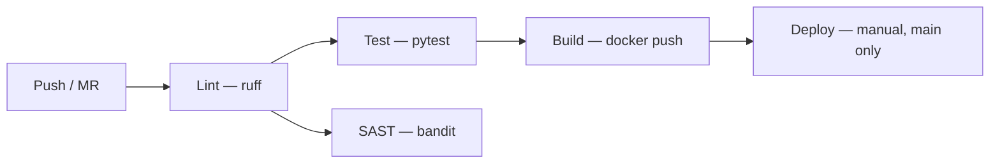

# Trainee Cloud & IA — Desafio Técnico

API Flask de health check com pipeline CI/CD completo, containerização Docker e infraestrutura como código para deploy no AWS ECS.

---

## Como Rodar a Aplicação Localmente

### Opção 1: Docker Compose (recomendado)

```bash
docker compose up --build
```

A aplicação estará disponível em `http://localhost:5000`.

### Opção 2: Docker Manual

> **Nota:** O Dockerfile usa BuildKit cache mounts (`--mount=type=cache`). Requer Docker com BuildKit habilitado. Se o build falhar com "the --mount option requires BuildKit", instale o `docker-buildx` plugin ou use `DOCKER_BUILDKIT=1 docker build ...`.

```bash
docker build -t trainee-devops-api .
docker run -d -p 5000:5000 --name trainee-api trainee-devops-api
```

### Opção 3: Python Direto

> **Requer Python >= 3.11** — o código usa `datetime.UTC`, introduzido no Python 3.11.

```bash
python3 -m venv venv
source venv/bin/activate
pip install -r requirements.txt
python app.py
```

### Verificando a Aplicação

```bash
curl http://localhost:5000/health
curl http://localhost:5000/
```

Ou use o script de healthcheck (sem dependência de Python, funciona com wget apenas):

```bash
chmod +x healthcheck.sh
./healthcheck.sh
./healthcheck.sh localhost 5000
```

### Rodar os testes localmente

```bash
pip install -r requirements.txt -r requirements-dev.txt
pytest test_app.py -v
```

---

## Como o Pipeline Funciona

### Fluxo Visual



O pipeline `.gitlab-ci.yml` possui 4 stages sequenciais + 1 job bonus de segurança:

### Stage 1: Lint

- **Ferramenta:** `ruff` — linter Python moderno, 10-100x mais rápido que flake8
- **O que faz:** Analisa `app.py` e `test_app.py` buscando erros de estilo, imports não utilizados e más práticas
- **Critério de falha:** Job falha se o ruff encontrar qualquer violação
- **Quando roda:** Em MRs e na branch main (controlado por `workflow.rules` para evitar pipelines duplicados)

### Stage 2: Test

- **Ferramenta:** `pytest`
- **O que faz:** Executa os testes unitários em `test_app.py` validando os endpoints `/health` e `/`
- **Critério de falha:** Job falha se qualquer teste não passar
- **Quando roda:** Em MRs e na branch main

### Stage 2 (bonus): SAST — Security Scan

- **Ferramenta:** `bandit`
- **O que faz:** Análise estática de segurança no código Python, identificando vulnerabilidades comuns
- **Critério de falha:** `allow_failure: true` por design — SAST surface findings sem bloquear deploys. Para projetos novos, bloquear por SAST arrisca falsos positivos travando o pipeline. Em produção, considerar gating em severidade HIGH após afinar exclusões.
- **Quando roda:** Na branch main, em MRs e em tags
- **Artefato:** Gera `bandit-report.json` para análise posterior

### Stage 3: Build

- **Ferramenta:** Docker (Docker-in-Docker) com BuildKit habilitado
- **O que faz:** Constrói a imagem Docker usando o Dockerfile com multi-stage build e faz push para o GitLab Container Registry com duas tags: commit SHA e `latest`
- **Critério de falha:** Job falha se o build ou push falhar
- **Quando roda:** Na branch main e em tags automaticamente; em MRs apenas manual (sem `allow_failure` — se alguém dispara manualmente, o resultado importa). Tags produzem imagens com o nome da tag (ex: `v1.0.0`).
- **Variáveis utilizadas:** `$CI_REGISTRY`, `$CI_REGISTRY_USER`, `$CI_REGISTRY_PASSWORD` (predefinidas pelo GitLab)
- **Nota TLS:** O job define `DOCKER_TLS_CERTDIR` e `DOCKER_HOST` conforme documentação GitLab. Runners compartilhados injetam `DOCKER_TLS_VERIFY` e `DOCKER_CERT_PATH` automaticamente. Em runners self-hosted com TLS estrito, pode ser necessário definir essas variáveis explicitamente.

### Stage 4: Deploy

- **O que faz:** Simula o deploy no AWS ECS imprimindo os comandos que seriam executados
- **Quando roda:** Apenas na branch `main`, com aprovação manual (`when: manual`)
- **Dependência:** Aguarda o stage de build completar (`needs: [build]`)

### Cache do Pipeline

Cache compartilhado entre jobs, key baseada no hash dos dois requirements files (`requirements.txt` + `requirements-dev.txt`) + prefixo por job name. Isso garante que:
- Cache é invalidado automaticamente quando as dependências mudam
- Cada job tem seu próprio namespace de cache (ruff e pytest não se contaminam)
- O cache de ruff não é invalidado por mudanças no pytest, e vice-versa

### Prevenção de Pipelines Duplicados

O bloco `workflow.rules` garante que pipelines só rodam em:
1. Merge request events
2. Pushes na branch main
3. Tags

Isso evita o problema comum de pipelines duplicados (um do MR event, outro do branch push) que desperdiça runner minutes.

---

## Estrutura do Repositório

```
.
├── app.py              # Aplicação Flask
├── test_app.py         # Testes unitários
├── requirements.txt    # Dependências Python (runtime apenas)
├── requirements-dev.txt # Dependências de desenvolvimento (pytest, ruff, bandit)
├── ruff.toml           # Configuração do linter
├── Dockerfile          # Containerização com multi-stage build
├── docker-compose.yml  # Compose para rodar localmente
├── healthcheck.sh      # Script de verificação de saúde (shell puro, sem python)
├── .gitlab-ci.yml      # Pipeline CI/CD
├── .dockerignore       # Arquivos ignorados no build Docker
├── .gitignore          # Arquivos ignorados pelo Git
└── terraform/
    ├── main.tf         # Provider AWS e backend S3
    ├── variables.tf    # Variáveis do Terraform
    ├── ecs.tf          # Recursos ECS, ALB, IAM, CloudWatch, Security Groups
    └── outputs.tf      # Outputs da infraestrutura
```

---

## Decisões Técnicas

### Dockerfile — Multi-stage Build

Separação entre ambiente de build (com pip, cache de downloads) e runtime (apenas o necessário para rodar). O stage `builder` instala dependências em `/install`, e o runtime copia apenas o resultado. Isso exclui cache do pip e ferramentas de build da imagem final, reduzindo tamanho e superfície de ataque.

### Imagem Base — python:3.12-alpine

Alpine (~50MB base) vs slim (~120MB base). Para uma API Flask simples sem dependências nativas, Alpine é suficiente. Menos pacotes = menor superfície de ataque.

### BuildKit Cache Mounts

O Dockerfile usa `--mount=type=cache,target=/root/.cache/pip` no `pip install` do builder. Isso permite que o Docker reutilize o cache de downloads do pip entre builds, mesmo que a camada de requirements.txt seja invalidada por outros motivos. Requer `DOCKER_BUILDKIT=1` (habilitado no pipeline CI).

### Usuário Não-root

Container roda como `appuser`. Se um atacante comprometer a aplicação, terá acesso limitado — sem privilícios de root. O ECS task definition também especifica `"user": "appuser"` para garantir que o runtime respeite isso.

### Healthcheck — Validação de HTTP 200 + corpo

O healthcheck valida explicitamente `assert r.status==200`. Embora `urlopen` lance `HTTPError` em 4xx/5xx por padrão, o `assert` torna a intenção explícita e funciona como defense-in-depth — se um handler customizado suprimir a exceção, o assert ainda garante que apenas 200 é aceito.

### Security Groups — Acesso ao container apenas via ALB

Duas security groups separadas:
- **ALB SG:** Aceita HTTP (porta 80) de `0.0.0.0/0` — ponto de entrada público
- **ECS SG:** Aceita tráfego apenas do ALB SG na porta 5000 — containers não são acessíveis diretamente da internet

Isso impede bypass do ALB. Em ECS com `awsvpc` network mode, tasks recebem seus próprios ENIs com IPs — sem essa restrição, qualquer um poderia atingir o container diretamente.

### Linter — ruff em vez de flake8

Ruff é 10-100x mais rápido que flake8, tem regras compatíveis e é o padrão moderno da comunidade Python. Em um pipeline CI/CD, velocidade importa. O arquivo `ruff.toml` configura as regras explicitamente: `E/W` (pycodestyle), `F` (pyflakes), `I` (isort), `UP` (pyupgrade para 3.12+), `B` (bugbear), `SIM` (simplify), `C4` (comprehensions) e `S` (bandit security). Rodar ruff sem config é aceitar defaults cegos — o `ruff.toml` documenta o que consideramos erro e por quê.

### Dependências — Runtime vs Desenvolvimento

`requirements.txt` contém apenas dependências de runtime (flask). `requirements-dev.txt` adiciona pytest, ruff e bandit. O Dockerfile instala apenas `requirements.txt`, excluindo ferramentas de teste da imagem de produção. Isso reduz a superfície de ataque — pytest, ruff e bandit não deveriam existir em um container que serve tráfego.

### SAST — Não-bloqueante por design

O job de SAST usa `allow_failure: true` intencionalmente. Para projetos novos, bloquear o pipeline por findings de SAST arrisca falsos positivos travando deploys. O scan reporta findings de severidade HIGH no log e gera artefato JSON para revisão manual. Em produção, após afinar exclusões, considerar gating em HIGH severity.

### readonlyRootFilesystem — Container imutável

O task definition do ECS define `readonlyRootFilesystem = true`. Se um atacante conseguir RCE, não pode escrever binários, scripts ou configs no filesystem do container. Flask não precisa de writes para esta aplicação — Python ignora `__pycache__` graciosamente quando o diretório é read-only. Em apps que precisam de `/tmp`, um tmpfs mount resolveria; aqui não é necessário.

### Deploy — Manual com `when: manual`

Em produção, deploy deve ser intencional. Mesmo na branch main, o deploy exige aprovação humana. Previne deploys acidentais e permite verificação do build antes de promover.

### Terraform — Simplificado mas Funcional

A configuração cria infraestrutura ECS completa (cluster, service, task definition, ALB com target group, security groups separados, IAM roles, CloudWatch logs). Usa a VPC default para simplificar, mas reconheço que em produção isso é inseguro (veja "O que faria diferente").

### Healthcheck.sh — Shell Puro

O script de healthcheck externo usa apenas `wget` e `grep`, sem dependência de Python. Funciona em qualquer ambiente Alpine sem instalar pacotes adicionais, e pode ser usado em pipelines CI ou monitoramento externo.

---

## O Que Eu Faria Diferente com Mais Tempo

1. **VPC dedicada com subnets privadas** — A configuração atual usa a VPC default com subnets públicas. Em produção, os containers ECS rodariam em subnets privadas, acessíveis apenas via ALB nas subnets públicas. Isso elimina a necessidade do workaround de security groups (embora as SGs separadas já mitiguem o risco).

2. **Pipeline de deploy real** — Implementaria deploy efetivo no ECS com AWS CLI, incluindo rollback automático se o health check pós-deploy falhar ( Circuit Breaker do ECS + verificação manual do target health).

3. **Staging environment** — Environment de staging que recebe deploy automático a cada merge na main, antes do deploy em produção.

4. **Auto-scaling** — Configuraria auto-scaling do ECS Service baseado em CPU e memória, com limites mínimos e máximos.

5. **Container registry scanning** — Trivy ou ECR image scanning antes do deploy, bloqueando imagens com vulnerabilidades críticas.

6. **Secrets management** — AWS Secrets Manager ou SSM Parameter Store para secrets, em vez de variáveis de ambiente diretas.

7. **Monitoring e alerting** — CloudWatch Alarms para latência, erros 5xx e health check failures, com notificações via SNS.

8. **Pipeline para o Terraform** — `terraform fmt -check`, `terraform validate` e `terraform plan` como jobs do pipeline, revisando mudanças de infraestrutura antes de aplicar. O `plan` seria postado como comentário no MR.

9. **Testes de integração** — Testes que sobem o container Docker e fazem requests reais contra a API rodando dentro dele, validando o Dockerfile end-to-end.

10. **HTTPS no ALB** — Adicionar certificado ACM + listener HTTPS (porta 443) com redirect HTTP→HTTPS.

---

## Como Usar o Terraform

### Pré-requisitos

- Terraform >= 1.5.0 instalado
- Credenciais AWS configuradas (`aws configure` ou variáveis de ambiente)
- Bucket S3 `terraform-state-trainee` criado para o backend (ou ajuste o `backend` em `main.tf` para local)

### Comandos

```bash
cd terraform

# Inicializa (baixa providers, configura backend)
terraform init

# Visualiza o que será criado
terraform plan

# Aplica a infraestrutura
terraform apply

# Para destruir (custo!)
terraform destroy
```

### Variáveis

| Variável | Default | Descrição |
|-----------|---------|-----------|
| `aws_region` | `us-east-1` | Região AWS |
| `environment` | `production` | Ambiente de deploy |
| `app_name` | `trainee-devops-api` | Nome da aplicação |
| `container_image` | `registry.gitlab.com/...` | Imagem Docker para o ECS |
| `container_port` | `5000` | Porta do container |
| `cpu` | `256` | CPU units (Fargate) |
| `memory` | `512` | Memória MiB (Fargate) |
| `desired_count` | `2` | Número de tasks ECS |

### Nota sobre GitLab Self-Hosted

Em instâncias self-hosted do GitLab, o Container Registry pode não estar habilitado por padrão. Verifique:
1. O registry está habilitado nas configurações do GitLab (`Settings → Container Registry`)
2. As variáveis `$CI_REGISTRY`, `$CI_REGISTRY_USER`, `$CI_REGISTRY_PASSWORD` estão disponíveis (são injetadas automaticamente quando o registry está ativo)
3. O runner tem permissão para fazer push no registry

---

## Como Usei IA Durante o Desafio

### Ferramenta

Utilizei o **opencode** (CLI de IA para engenharia de software) com o modelo **GLM-5.1** como assistente durante todo o processo.

### O que pedi a IA

1. **Dockerfile** — Prompt: *"Gere um Dockerfile para a Flask API com multi-stage build, usuário não-root e healthcheck."* O resultado foi bom, mas o healthcheck apenas verificava conectividade sem validar o HTTP status code — eu corrigi para checar `assert r.status==200`. Também adicionei BuildKit cache mounts que a versão inicial não usava.

2. **App.py** — Prompt: *"O código fornecido pelo desafio usa datetime.utcnow(), que está deprecated. Corrija para o equivalente moderno."* Substituí por `datetime.now(UTC)` que retorna timestamps timezone-aware, alinhado com as recomendações da PEP 685.

3. **Pipeline CI/CD** — Prompt: *"Crie um .gitlab-ci.yml com stages de lint, test, build e deploy para a Flask API."* A IA gerou regras que causavam pipelines duplicados (MR event + branch push simultâneos) — eu adicionei `workflow.rules` para resolver. O SAST tinha `|| true` que tornava o scan inútil — corrigi para usar `--severity-level high`. O build em MRs tinha `allow_failure: true` que ocultava falhas — removi.

4. **Terraform para ECS** — Prompt: *"Gere infraestrutura Terraform para deploy desta API no AWS ECS Fargate com ALB, security groups e IAM."* A IA produziu um ARN de policy IAM com sintaxe inválida (`arn:aws:iam:::aws:policy/...` — um `:` a mais), outputs duplicados entre `ecs.tf` e `outputs.tf`, e um security group que abria a porta do container para `0.0.0.0/0`. Corrigi todos os três e separei as security groups.

5. **Docker Compose e healthcheck.sh** — Prompt: *"Crie um docker-compose.yml e um script de healthcheck externo que não dependa de Python."* O healthcheck.sh inicial ainda dependia de `python3` para parsear JSON. Reescrevi usando `wget` + `grep` puro (shell).

6. **README** — Prompt: *"Gere um README completo documentando a aplicação, pipeline, infraestrutura e uso de IA."* A IA não incluiu instruções para rodar o Terraform, não mencionou considerações para GitLab Self-Hosted, e a seção de IA era genérica — reescrevi com exemplos específicos dos bugs que encontrei e corrigi.

### O que funcionou bem

- **Boilerplate e scaffolding** — A IA é excelente para gerar a estrutura inicial de arquivos de configuração (Dockerfile, CI/CD, Terraform). Economizou horas de trabalho.
- **Boas práticas automáticas** — Sem eu pedir explicitamente, a IA sugeriu multi-stage build, usuário não-root, healthcheck e cache no pipeline.
- **Velocidade** — O que tomaria horas de pesquisa e escrita foi gerado em minutos, permitindo focar na revisão e correção.

### O que não funcionou tão bem

- **Detalhes específicos de plataforma** — A IA gerou ARN IAM inválido, outputs duplicados no Terraform, e security groups que comprometiam a segurança do deploy ECS. Nenhum desses erros seria óbvio sem revisão manual cuidadosa.
- **Healthcheck com intenção implícita** — A IA gerou healthchecks que verificavam conectividade mas não validavam explicitamente o HTTP status code. Embora `urlopen` lance `HTTPError` em 5xx, o `assert r.status==200` torna a intenção explícita e funciona como defense-in-depth se a exceção for suprimida por algum handler.
- **CI/CD com falsos negativos** — O SAST com `|| true`, o build com `allow_failure: true`, e pipelines duplicados são antipadrões que parecem funcionais mas subvertem o propósito do pipeline.
- **Segurança por aparência** — A IA gerou arquivos que *pareciam* seguros (security groups, non-root user) mas com configurações que neutralizavam a proteção (porta aberta para o mundo, healthcheck sem validação real).

### Aprendizados

- **IA é uma aceleradora, não um substituto para revisão.** Os erros mais críticos (IAM ARN, security group, healthcheck falso-positivo) pareciam corretos à primeira vista. Só a revisão linha a linha os encontrou.
- **Teste tudo.** O healthcheck.sh falha silenciosamente se python3 não existe; o Terraform falha no plan por ARN inválido; o pipeline aprova builds quebrados. Nada disso é óbvio sem execução real.
- **Documentar os erros da IA é mais valioso que documentar os acertos.** Mostra que você entende o código, não apenas copiou.
